# Project Description

## 1. Project Overview

- **Project Name:** Sausage Man: Legends of Midgard
- **Project by:** Inthat Niramarn 6810545999

**Brief Description:**

Sausage Man: Legends of Midgard is a top-down 2D action shooter built with Python and Pygame. The player controls the Sausage Man — a fearless, round pink hero — through five increasingly difficult stages of a Norse-inspired world. Each stage features a hand-tuned roster of enemies, a unique elite shooter, and a stage boss with a cinematic entrance. The player must shoot, dodge, collect loot, and manage resources (HP, armor, mana) to survive and eventually defeat the Demon King Baldr.

The game draws inspiration from the mobile game *Soul Knight*, emphasizing weapon variety and pick-up-and-play action. Every run generates fresh stage layouts using Binary Space Partitioning (BSP), and all sound effects are synthesized procedurally at runtime using NumPy waveforms — no external audio files are required.

- **Problem Statement:**
  Players need an engaging, replayable action game that can be run entirely from source with minimal setup. The game also serves as a demonstration of object-oriented design in Python and data-driven gameplay analytics.

- **Target Users:**
  Computer programming students, indie game enthusiasts, and anyone who wants a fun, lightweight desktop game to run locally.

- **Key Features:**
  - 5 themed stages with procedurally generated BSP room layouts
  - 30+ weapons across 4 rarities (Common, Rare, Epic, Legendary) with 8 bullet patterns
  - 8 armor sets with animated particle/aura overlays drawn procedurally
  - Enemy state-machine AI (Idle / Patrol / Chase / Attack / Flee)
  - 5 unique stage bosses with cinematic spawn and death sequences + screen shake
  - 3 active skills: Dash, Star Shot, and Frenzy with cooldown/mana system
  - Inventory, Equipment, and in-game Shop systems
  - Procedural audio synthesis (no external sound files)
  - Gameplay statistics saved to CSV and visualized in a 6-panel Matplotlib dashboard
  - Shooting Range practice mode from the main menu

**Screenshots:**

| Gameplay |
|---|---|
  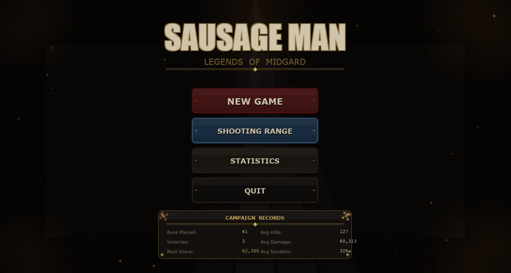
  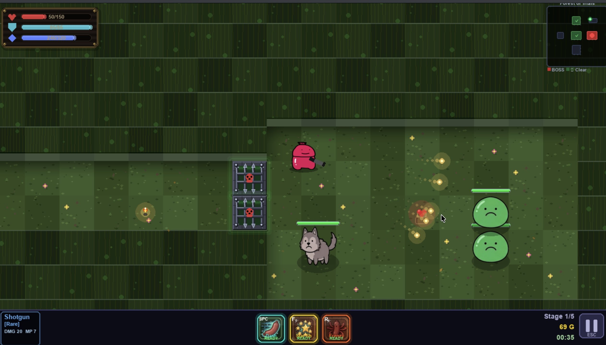
  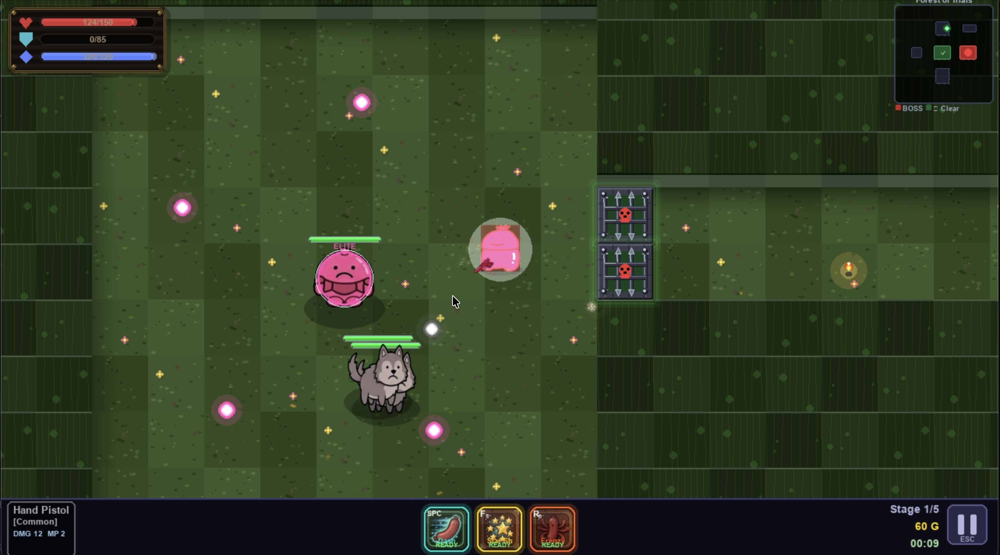
  
  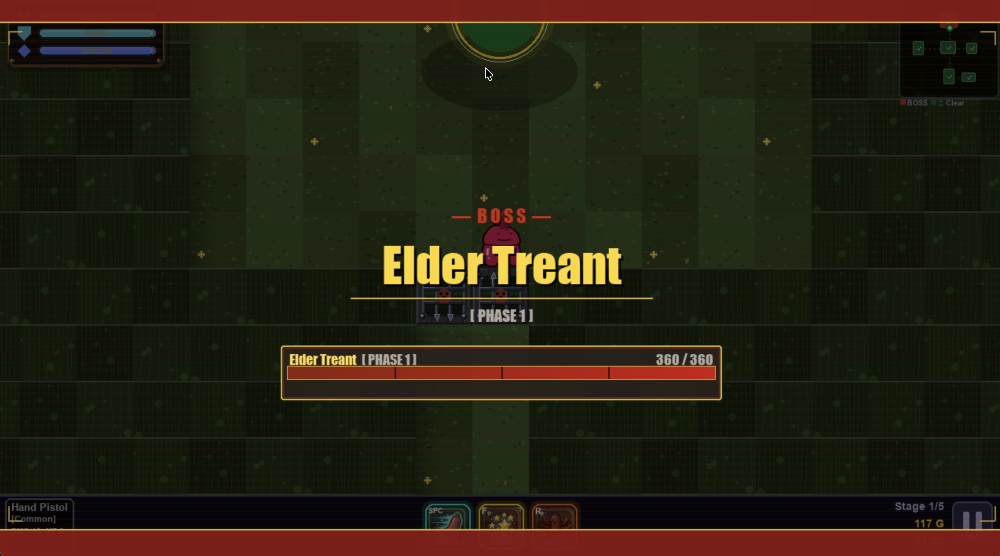
  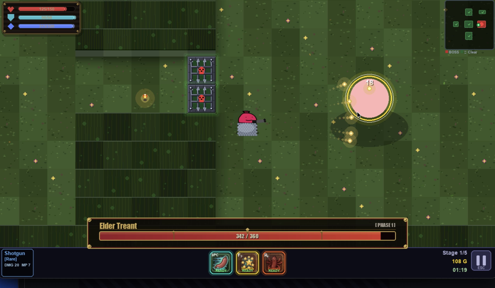
  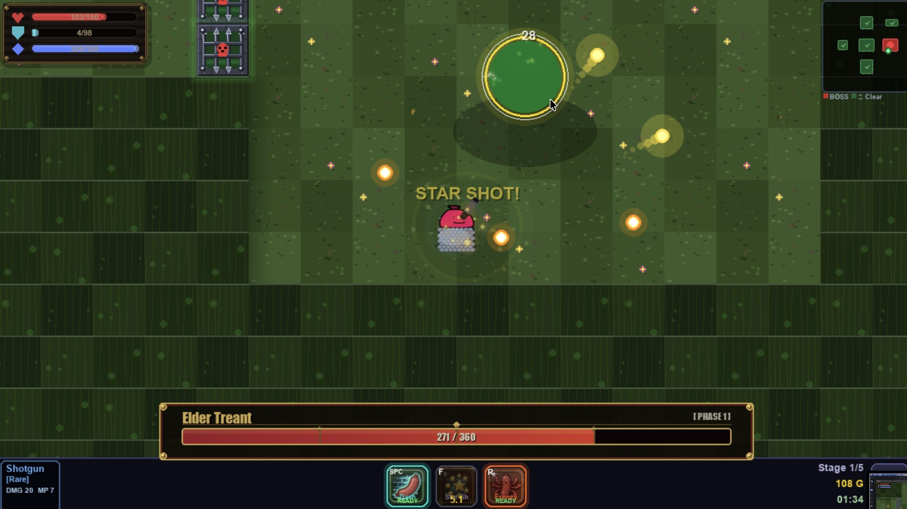
  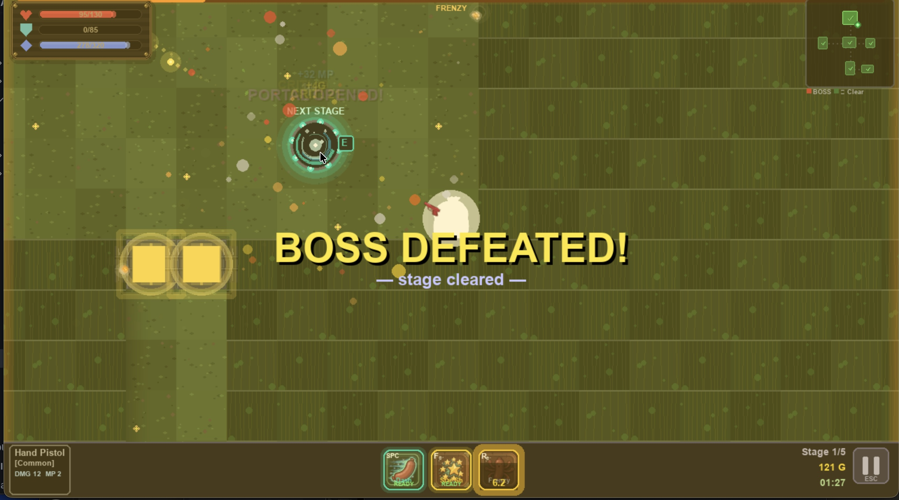
  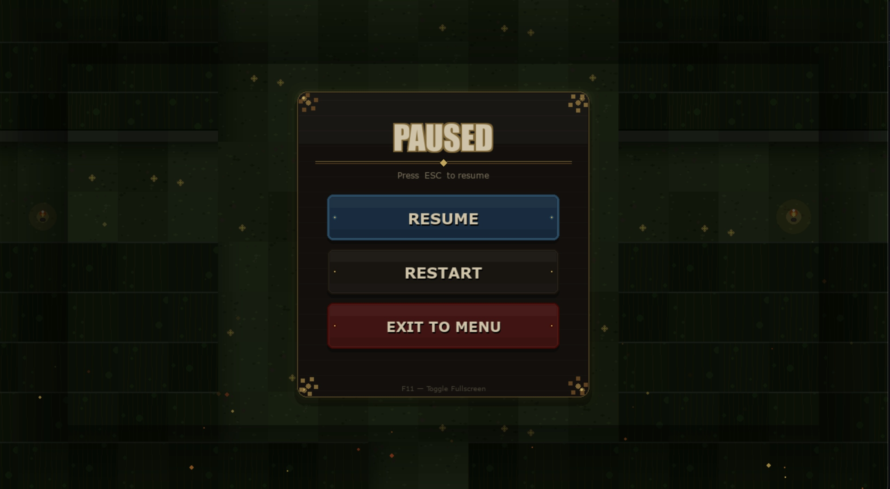
  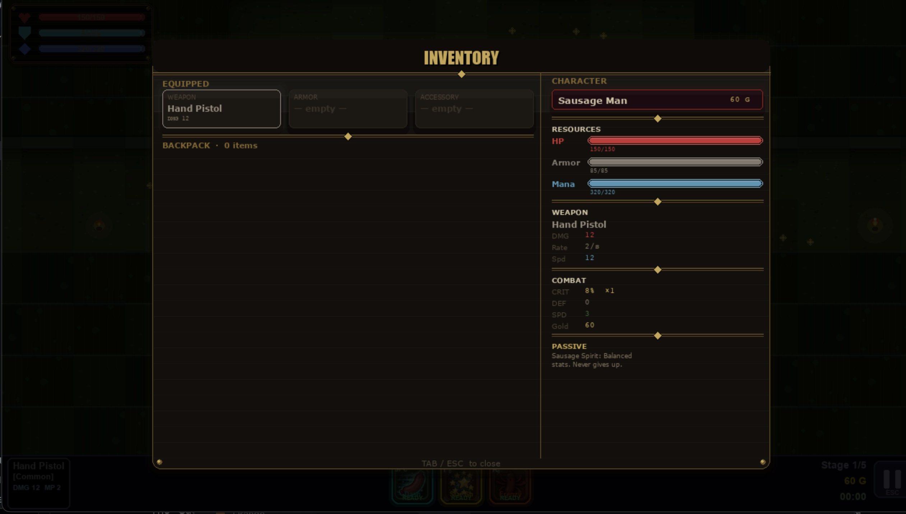
  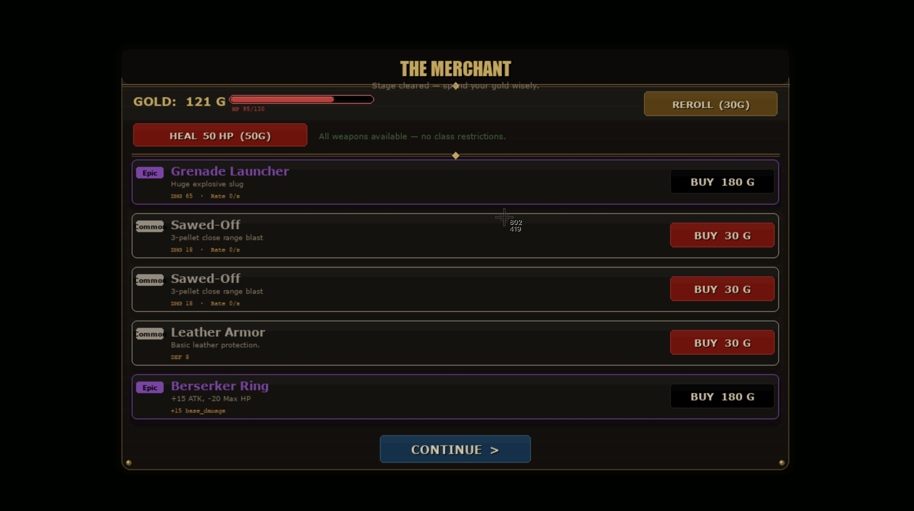
  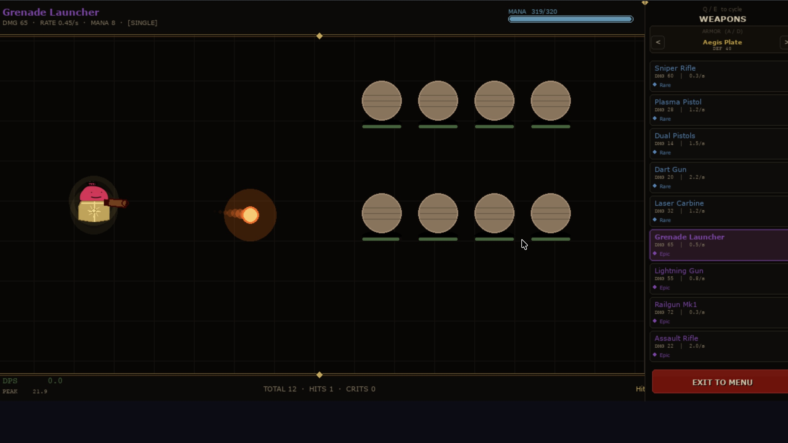
  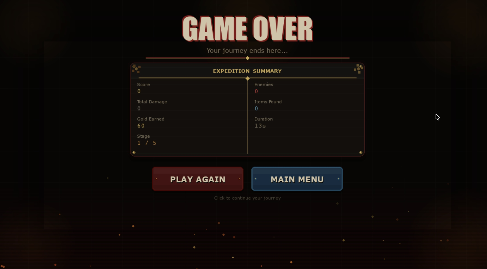

  ### Data Visualization


**Proposal:** [Project Proposal (PDF)](proposal.pdf)

**YouTube Presentation:** [▶ Watch on YouTube](https://www.youtube.com/watch?v=REPLACE_WITH_YOUR_VIDEO_ID)
> *(~7 min) — Covers game demo, OOP class design, and data visualization walkthrough.*

---

## 2. Concept

### 2.1 Background

The project was inspired by *Soul Knight* — a mobile roguelite shooter where the simplicity of controls and the variety of weapons create highly replayable sessions. The goal was to recreate that feeling in a desktop Python game while demonstrating real object-oriented design patterns learned in Computer Programming II.

The "Sausage Man" character emerged as the project mascot: a cheerful, round sausage-shaped hero who faces impossible odds with a smile. The Norse mythology theme (Midgard, Baldr, Elder Treant) was chosen to give the world a coherent narrative backdrop without requiring extensive lore.

The project also addresses a practical gap: many game projects use pre-made assets (sounds, sprites). This project demonstrates that a complete game experience can be built from scratch using only code — all audio is generated algorithmically and all visual effects are drawn with Pygame primitives.

### 2.2 Objectives

- Build a complete, playable action game with a clear win/lose condition using Python and Pygame.
- Demonstrate object-oriented programming through a clean class hierarchy: items, enemies, bullets, UI screens, and the central game manager all as separate, well-defined classes.
- Implement a data collection pipeline that records meaningful gameplay statistics per session, stores them in CSV files, and presents them visually with Matplotlib.
- Keep the game fully self-contained: all audio synthesized in code, all graphics drawn programmatically or loaded from local PNGs.
- Provide a maintainable, well-commented codebase that can be extended with new stages, weapons, and enemy types.

---

## 3. UML Class Diagram

The UML class diagram is attached in **[UML.pdf](./UML.pdf)** in the project root.

**Summary of key relationships:**

```
Item (base)
  ├── Weapon
  ├── Armor
  └── Accessory

Enemy (base)
  ├── RangedEnemy
  ├── EliteEnemy
  └── BossEnemy

Bullet (base)
  ├── LaserBeam
  └── EnemyBullet (in enemy.py)

GameManager
  ├── owns → Player
  ├── owns → Stage
  ├── owns → StatsTracker
  ├── owns → SoundManager
  ├── manages list → Enemy
  ├── manages list → Bullet / LaserBeam / EnemyBullet
  ├── manages list → DroppedItem
  └── delegates UI → MainMenuScreen, ClassSelectScreen,
                      InventoryScreen, ShopScreen,
                      PauseScreen, GameOverScreen,
                      ShootingRangeScreen

Stage
  └── spawns → Enemy (via make_enemy factory)

Player
  ├── equipment dict → Weapon, Armor, Accessory
  └── inventory list → Item
```

---

## 4. Object-Oriented Programming Implementation

| Class | File | Description |
|---|---|---|
| `Item` | `item.py` | Abstract base for all collectible items. Holds name, type, rarity, color, description, and sell price. Provides `apply_effect` / `remove_effect` for stat bonuses. |
| `Weapon` | `item.py` | Subclass of Item. Stores damage, fire rate, bullet speed, bullet pattern, and mana cost. Supports melee and ranged variants. |
| `Armor` | `item.py` | Subclass of Item. Stores defense value; equipping triggers animated visual overlay on the player. |
| `Accessory` | `item.py` | Subclass of Item. Applies a `stat_bonus` dict (ATK, SPD, Max HP, Max Mana, Crit%) to Player attributes on equip/unequip with proper clamping. |
| `Player` | `player.py` | Represents the player character. Handles movement with wall collision, shooting cooldown, mana regen, armor regen, damage/crit calculation, skill cooldowns, inventory management, and procedural armor visual FX. |
| `Enemy` | `enemy.py` | Base class for all enemies. Implements 5-state AI (IDLE, PATROL, CHASE, ATTACK, FLEE), wall-aware movement, shooting, drop spawning, and PNG sprite loading with polygon fallback. |
| `RangedEnemy` | `enemy.py` | Subclass of Enemy with tuned shoot-range behavior. |
| `EliteEnemy` | `enemy.py` | Subclass with enhanced stats, multi-shot patterns, and elite visual effects. |
| `BossEnemy` | `enemy.py` | Subclass with high HP, multi-phase attack patterns, and cinematic behaviors. |
| `EnemyBullet` | `enemy.py` | Projectile fired by enemies. Travels in a fixed direction, deals damage on player contact. |
| `Bullet` | `bullet.py` | Player projectile. Supports pierce, bounce, and various bullet patterns. |
| `LaserBeam` | `bullet.py` | Instant-hit laser with configurable width, color, and lifetime. |
| `DroppedItem` | `bullet.py` | World-space dropped item waiting to be picked up. |
| `FloatingText` | `bullet.py` | Animated damage/crit number floating up from hit position. |
| `Portal` | `bullet.py` | Animated portal that appears after stage clear; player walks into it to advance. |
| `Stage` | `stage.py` | Generates a BSP dungeon layout, renders themed floor/wall tiles with procedural textures, manages ambient particles, torches, and enemy spawning per room. |
| `GameManager` | `game_manager.py` | Central controller. Owns all game objects, manages state machine (Menu → Playing → Paused → Shop → Game Over → Victory), handles input dispatch, collision detection, boss cinematics, and screen shake. |
| `StatsTracker` | `stats_tracker.py` | Records per-run gameplay events (kills, damage, items, gold, duration) to CSV. Provides aggregate summary and a 6-panel Matplotlib visualization dashboard. |
| `SoundManager` | `sound_manager.py` | Generates all sound effects at runtime using NumPy waveform synthesis (sweep, sine, noise, square). Manages per-sound cooldowns and master volume. |
| `MainMenuScreen` | `ui.py` | Renders the main menu with animated background and navigation buttons. |
| `ClassSelectScreen` | `ui.py` | Character class selection screen (currently one class: Sausage Man). |
| `InventoryScreen` | `ui.py` | Full-screen inventory grid with item tooltips and stat comparison. |
| `ShopScreen` | `ui.py` | In-game shop; shows randomized items for purchase using gold. |
| `PauseScreen` | `ui.py` | Pause overlay with resume, sound toggle, and quit options. |
| `GameOverScreen` | `ui.py` | Death / Victory screen showing run summary. |
| `ShootingRangeScreen` | `ui.py` | Practice mode; player can fire freely at targets to test weapons. |

---

## 5. Statistical Data

### 5.1 Data Recording Method

Gameplay data is collected by `StatsTracker` during every run. When a run starts (`start_run`), a unique `session_id` is generated. During gameplay, `log_event()` is called for key events: kills, damage dealt, items picked up, gold earned, and stage completions. When a run ends (`end_run`), the final row is written to `stats/gameplay_data.csv`. Combat events are also buffered and flushed in batches to `stats/combat_log.csv`.

Both CSV files are created automatically on first launch. The dashboard is accessible from the main menu and reads the CSVs at render time.

### 5.2 Data Features

**`stats/gameplay_data.csv`** — One row per run:

| Feature | Description |
|---|---|
| `session_id` | Unique run identifier (timestamp + random suffix) |
| `timestamp` | ISO-format datetime of run start |
| `char_class` | Character class played (e.g., "Sausage Man") |
| `outcome` | `"death"` or `"victory"` |
| `score` | Composite score (kills × EXP × 10 + item rarity bonuses + stage clears) |
| `enemies_defeated` | Total enemies killed in the run |
| `total_damage` | Sum of all damage dealt to enemies |
| `duration_sec` | Wall-clock seconds the run lasted |
| `items_collected` | Number of items picked up |
| `gold_earned` | Total gold accumulated |
| `stage_reached` | Furthest stage index reached (1–5) |
| `boss_kills` | Number of bosses defeated |

**`stats/combat_log.csv`** — One row per hit:

| Feature | Description |
|---|---|
| `session_id` | Links back to the run |
| `tick` | Incremental hit counter within the session |
| `damage` | Damage value of the individual hit |
| `is_crit` | 1 if the hit was a critical strike, 0 otherwise |
| `enemy_type` | Type string of the enemy hit (e.g., "Slime", "Bone Overlord") |

The Matplotlib dashboard visualizes these six views:
1. Score per run (line chart with fill)
2. Enemies defeated distribution (histogram)
3. Average score by class (bar chart)
4. Run duration distribution (histogram)
5. Furthest stage reached per run (bar chart)
6. Kills vs. total damage scatter plot, coloured by outcome (death/victory)

---

## 6. Changed Proposed Features

- The original proposal included multiple playable character classes. The final version ships with a single class (Sausage Man) with a balanced, complete skill set. The class-select screen is present but only one class is available.
- The level-up system was simplified — the `level_reached` field remains in the CSV for compatibility, but the in-run level-up UI was removed in favour of item-based progression only.
- Boss multi-phase behaviors were scoped down to single-phase patterns for the submission deadline; phase transitions remain a documented planned feature.

---

## 7. External Sources

1. **Pygame** — https://www.pygame.org (LGPL 2.1)
2. **NumPy** — https://numpy.org (BSD 3-Clause)
3. **Pandas** — https://pandas.pydata.org (BSD 3-Clause)
4. **Matplotlib** — https://matplotlib.org (Matplotlib License / PSF-compatible)
5. **Seaborn** — https://seaborn.pydata.org (BSD 3-Clause)
6. **Sausageguy.png** — Original character artwork created for this project.
7. Enemy and gun sprite PNGs in `sprite/` — Original artwork created for this project.
