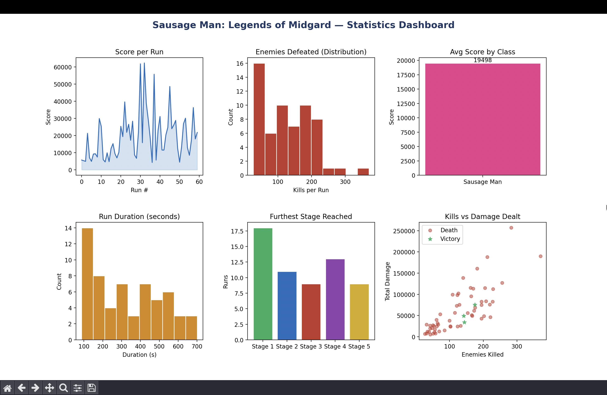
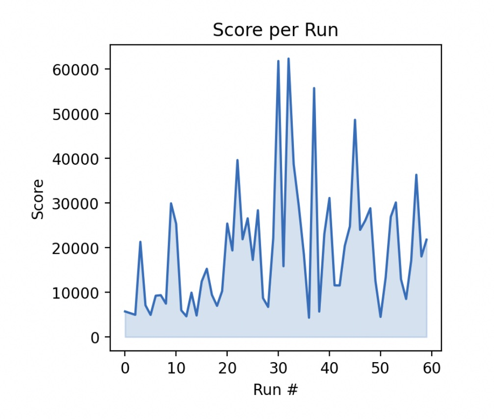
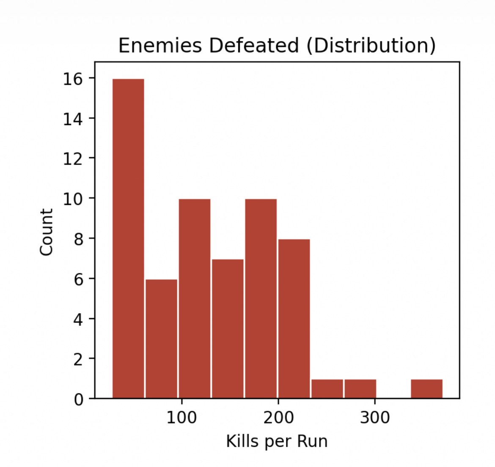
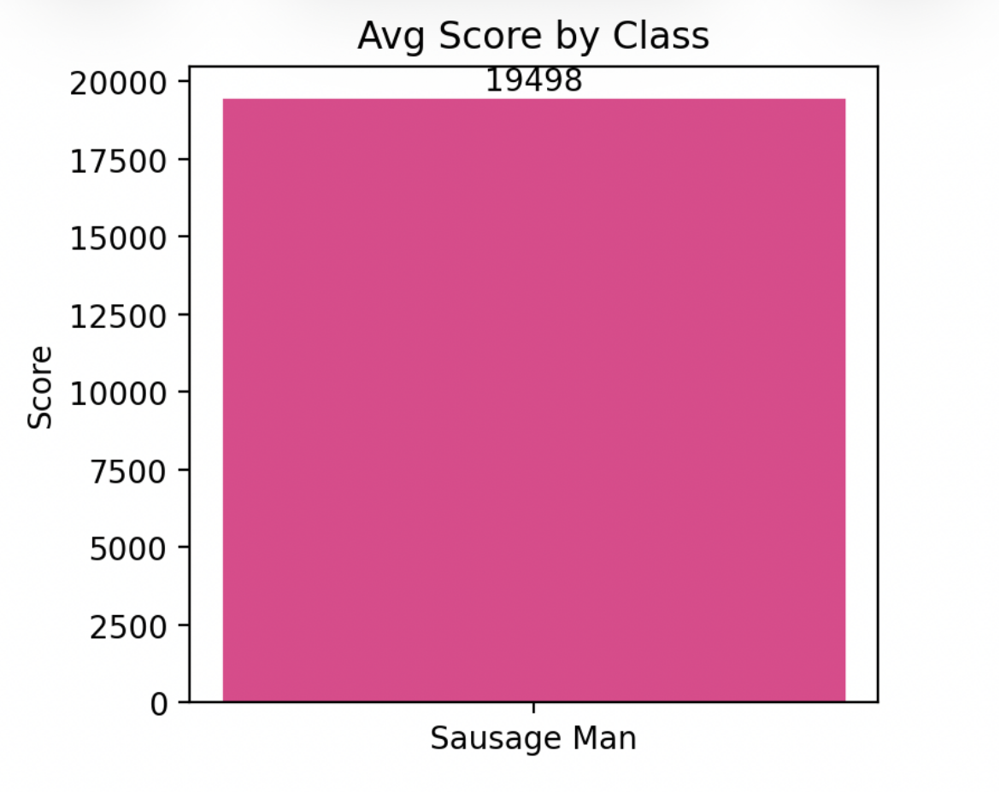
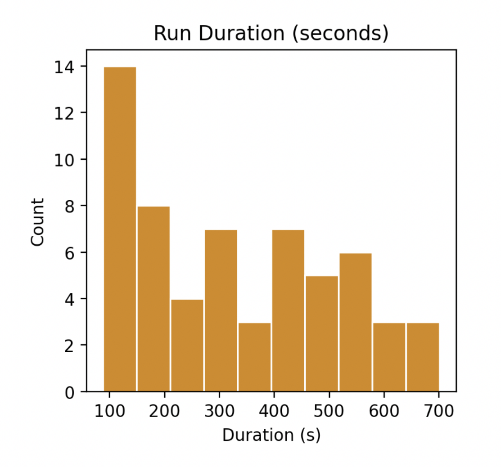
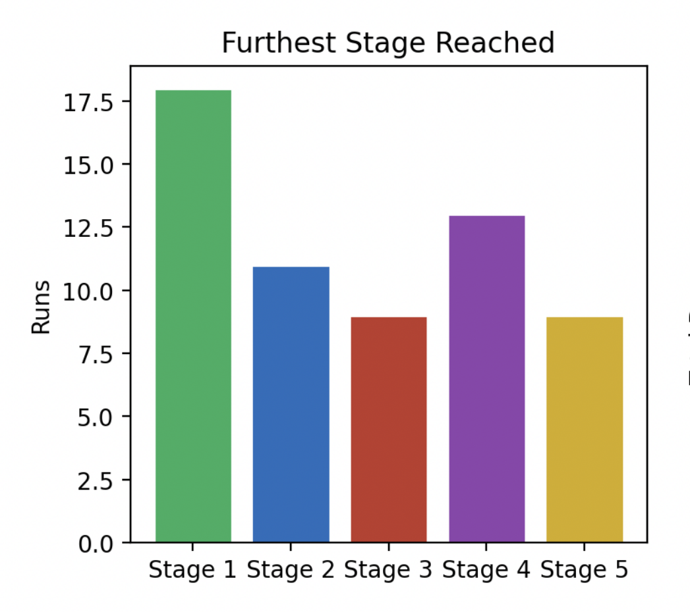
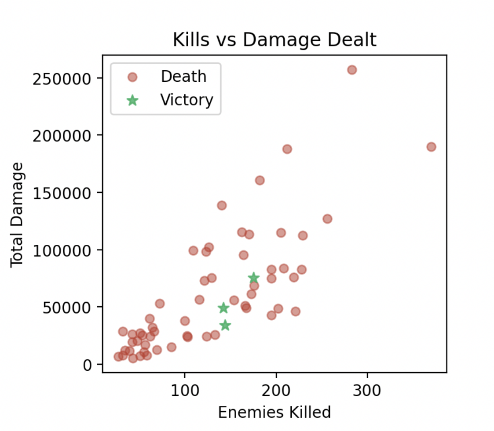

# Data Visualization

This document describes every visualization in the Sausage Man: Legends of Midgard statistics dashboard. The dashboard is accessible from the **Main Menu → Statistics** button and is rendered with Matplotlib using data from `stats/gameplay_data.csv` and `stats/combat_log.csv`.

---

## Dashboard Overview

The dashboard is a single 6-panel Matplotlib window that summarizes all recorded gameplay runs in one view. It is divided into two rows of three charts, each focusing on a different dimension of gameplay performance: scoring trends, combat effectiveness, stage progression, and run duration. The dashboard updates automatically every time it is opened, reading all rows stored in the CSV at that point in time.

---

## Panel 1 — Score per Run (Line Chart)

This line chart plots the composite score achieved in each run in chronological order, with the area under the line filled for visual clarity. The score is computed as the sum of kills × EXP × 10, item-rarity bonuses (Common = 10 pts, Legendary = 500 pts), and stage-clear bonuses (stage index × 500), doubled on a victory run. The chart makes it easy to see whether the player is improving over time, identify outlier high-score runs, and spot performance regressions.

---

## Panel 2 — Enemies Defeated Distribution (Histogram)

This histogram shows how many enemies the player defeats per run across all recorded sessions. The x-axis is the kill count per run and the y-axis is the frequency (number of runs that fall into each bin). A right-skewed distribution indicates that most runs end early (fewer kills), while the tail captures longer, more skilled runs. This metric is useful for understanding the typical combat intensity of a session and whether the player is surviving long enough to engage the full enemy roster.

---

## Panel 3 — Average Score by Class (Bar Chart)

This bar chart shows the average score grouped by character class. In the current version only one class (Sausage Man) is available, so the chart displays a single bar. The bar is labeled with its exact numeric value. This panel is designed to scale naturally if additional classes are added in future versions, making it straightforward to compare class performance at a glance.

---

## Panel 4 — Run Duration Distribution (Histogram)

This histogram shows the distribution of run lengths measured in seconds. The x-axis is the duration and the y-axis is the count of runs in each time bucket. Short durations cluster toward the left, representing runs that ended in early deaths, while longer durations correspond to runs where the player progressed further. Cross-referencing this histogram with the stage-reached chart (Panel 5) helps confirm whether longer runs actually result in deeper stage progression.

---

## Panel 5 — Furthest Stage Reached (Bar Chart)

This bar chart counts how many runs reached each stage (1 through 5) as the furthest point before death or victory. Each bar is colored distinctly to help distinguish the stages. The chart reveals the difficulty curve of the game: a large spike at Stage 1 suggests that many players die in the first stage, while a more even distribution across stages indicates a balanced progression curve. A bar at Stage 5 corresponds to completed victory runs.

---

## Panel 6 — Kills vs. Total Damage Scatter Plot

This scatter plot places each run as a point with the number of enemies killed on the x-axis and total damage dealt on the y-axis. Points are colored red for runs that ended in death and green stars for runs that ended in victory. The chart reveals the relationship between combat volume and output: runs in the upper-right area represent high-kill, high-damage sessions. Victory runs (green stars) typically cluster toward the right, confirming that surviving long enough to kill more enemies is the primary path to winning.
